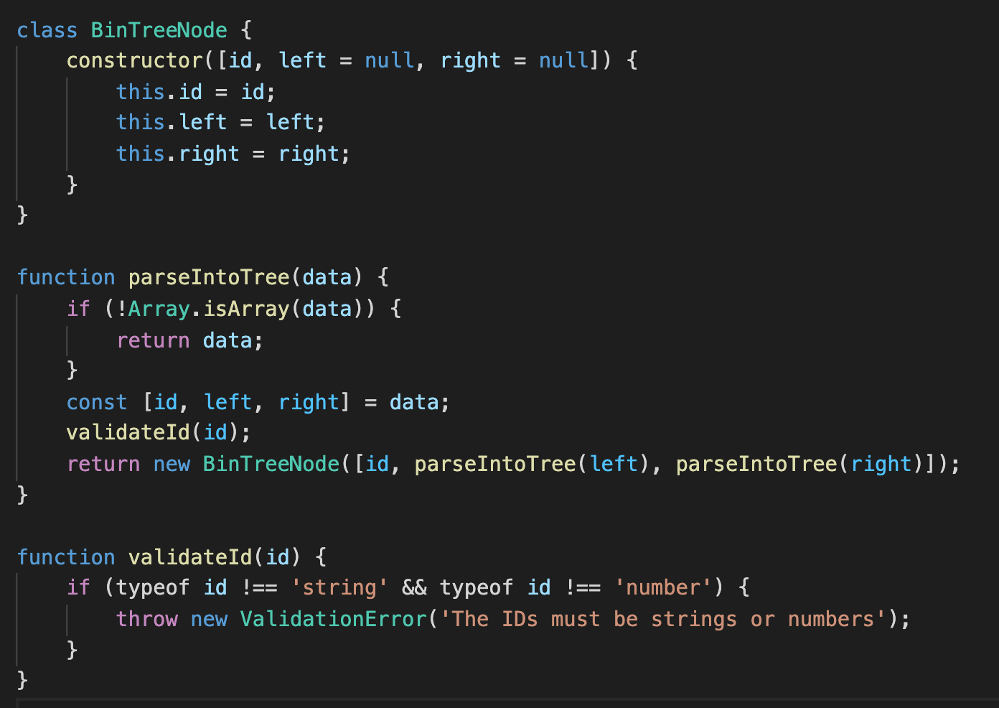
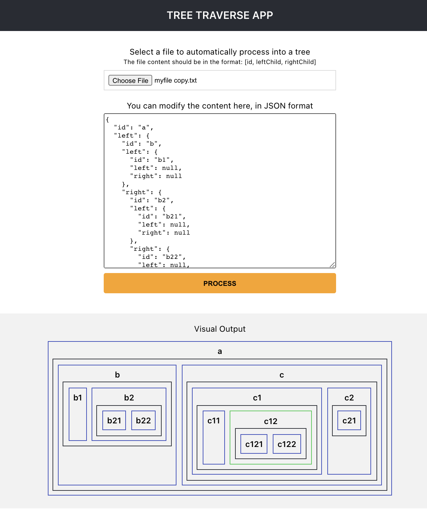
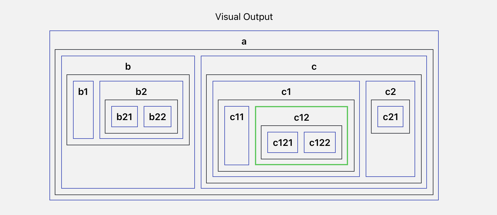

# Tree Traverse App

This project was bootstrapped with [Create React App](https://github.com/facebook/create-react-app).

## Solutions

### Problem #1

It is located in src/utils/tree.js, between lines 3-25.

### Problem #2

### Problem #3

To verify problem #2 and #3, run in the directory project:

#### `npm ci && npm start`

Runs the app in the development mode.\
Open [http://localhost:3000](http://localhost:3000) to view it in the browser.

The page will reload if you make edits.\
You will also see any lint errors in the console.

_On the Media folder, there is a file sample named sampletree.txt you can use to visualize the tree._

#### `npm run build`

Builds the app for production to the `build` folder.\
It correctly bundles React in production mode and optimizes the build for the best performance.

The build is minified and the filenames include the hashes.\

## Considerations

- The project was built using create-react-app
- It uses emotion (css-in-js)
- It uses hooks and context for the state management

## Bonus: Current Enhancements

- The app is responsive

- The fetch button was removed because it was unnecessary. The application would try to automatically fetch the file once it receives one. If there is an error it notifies the user and the text area does not get updated since the parse was not successful.

- The PROCESS button will try to parse the text area when the user modifies the content. It will catch all possible errors:

  - JSON format errors
  - IDs different from number or string
  - When the user tries to add a key different from "id", "right" or "left"

## Future Enhancements

- Implement unit testing
- Add a Drag-and-Drop area for the file
- Include the ability to use an URL to fetch the data
